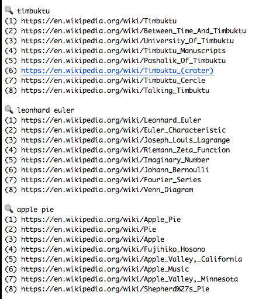
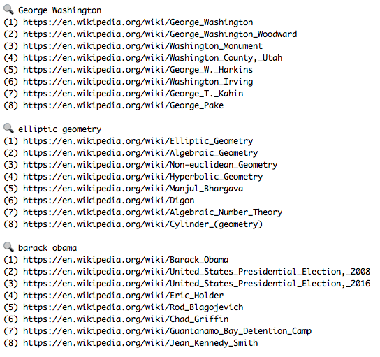
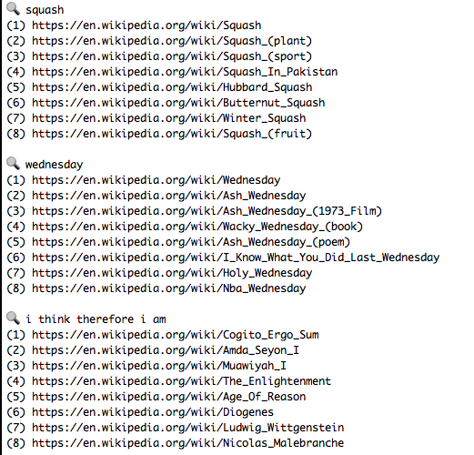
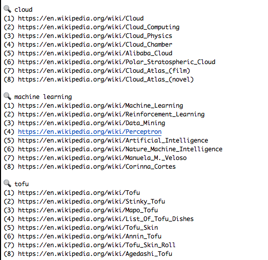

# Wigle
Wigle is a fast, keyword-based search engine for finding Wikipedia articles, that can be used directly from your terminal. 

## [wi]kipedia + goo[gle]!
Wigle can be run from the terminal and, once loaded, returns ultra fast search results.
Wigle supports single and multi word search queries.

## Algo Overview
Wigle has different logic for single and multi word queries. Single-word logic queries look through a large number (~1m) of titles for an exact or partial title match, and prioritizes any that have been crawled with high relevance/reputation scores. Crawling takes a significant amount of time, so this approach allows us to blend
knowledge of titles with knowledge of a limited number of important articles (~50k).

Multi-word logic is similar but uses a heurestic algorithm to use individual word scores to produce an overall search score.

Wigle attempts to figure out the relevance (to a search) and (overall) reputation of a page, as well as the relationship between them to serve accurate results. Wigle also attempts to determine what the most important links to crawl next are, and to record the most important link titles.

## Examples
Here are some example searches and results using Wigle.

